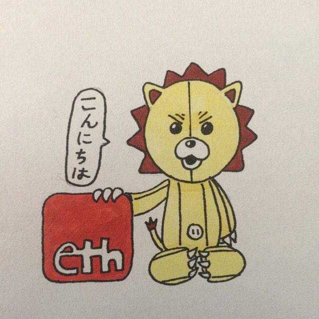

# History

*Jasonette* was created by *"Ethan Gliechtenstein"*, a New York developer. Probably from Bushwick. Who's real identity nobody knows.

*Jasonette* core began in Late 2014 as an app named *"Ethan"*  (http://www.textethan.com/)

It got quickly popular.

- https://twitter.com/Kelvin_T_/status/557001903851065346

- https://techcrunch.com/2014/10/30/meet-samantha-ethan-apps-sister/

- https://www.nytimes.com/2014/12/18/style/ethan-siri-meets-dr-phil.html

- https://www.theguardian.com/technology/2014/dec/04/-sp-ten-best-messaging-apps

- http://www.cnn.com/2014/10/11/tech/askethan-app

- http://www.spiegel.de/netzwelt/apps/ask-ethan-app-beantwortet-fragen-der-nutzer-a-997335.html

- http://www.newsnet5.com/the-now/some-guy-named-ethan-created-a-smartphone-app-ask-him-anything-and-get-answers

- http://www.dazeddigital.com/artsandculture/article/22152/1/this-irl-siri-app-wants-to-answer-all-your-burning-questions

- http://www.businessinsider.com/ethan-is-the-top-app-on-product-hunt-2014-10

- http://www.sfgate.com/business/article/Stupid-apps-but-not-always-a-stupid-idea-5843629.php

Some time after that Ethan began extracting the core, refining the api and creating documentation. Finally releasing the first version of Jasonette on November 3th 2016

- https://www.producthunt.com/posts/jasonette

- https://twitter.com/jasonclient/status/794175517763272708

Ethan worked on *Jasonette*, *Cell* and *ST* for nearly 2 years straight full-time. Until June 9 2018 were he misteriosly disappeared without a trace. Later on November 6th 2018. *Jasonelle Team* took the lead.

The original repositories of *Jasonette, Cell and ST* are:

- https://github.com/jasonette
- https://github.com/intercellular
- https://github.com/selecttransform

PD: If you want to know that character Ethan uses it's Kon from Bleach 💯 (http://bleach.wikia.com/wiki/Kon)
