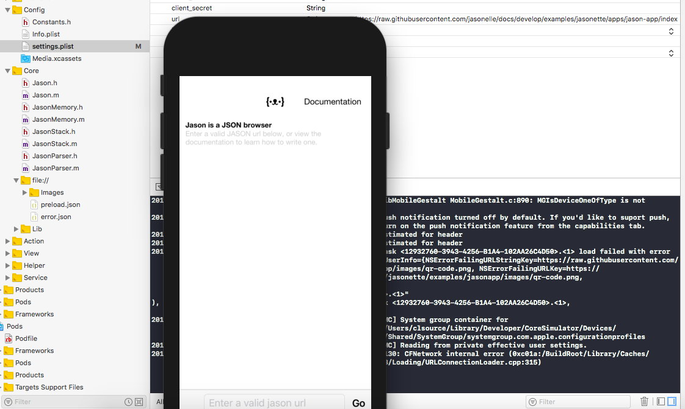

## Jason App 

**{ ·ᴥ·}**

Jason is a single app that lets you summon and bookmark 
multiple Jasonette apps simply by entering the JSON url, 
**without building your own physical app or setting up 
development environment.**

It's good for using as a container for single purpose apps 
or quick disposable apps, prototyping, beta testing, etc.

| | |
|--|--|
|

### How is related to Jasonette?

Maybe it's easier if we put it this way:

*Jason* **{ ·ᴥ·}** is like a Web browser, 
*Jasonette* **{ ˃̵̑ᴥ˂̵̑}** is the Web browser's engine.

### What is it?

**Jason** is an app that lets you bookmark and run multiple
*Jasonette* apps without building your own. 
*Jason* itself is built with *Jasonette*.

**Jasonette** is the open source app framework 
that lets you build your own publishable app.

### When to use?

When you need to...

**Jason**

- Start building without a development environment like *XCode* or *Android Studio*.
- Useful for quick prototyping.
- Beta test your *Jasonette* app with friends before submitting to the app store. Just need to share URL.
- Bookmark and run multiple *Jasonette* apps from a single app.
- Build apps that can't be / don't need to be published to the *App Store*</li>
- Disposable apps, private apps.

**Jasonette**

- When you need to package up an app so you can publish to the **App Store**.

### How to Install

Installing *Jason App* is similar to creating a custom *Jasonette App*.
The main difference is that you only made this once and you will be ready
to start testing your JSONs.

- 1. Download *Jasonette* from the releases repository ([https://github.com/jasonelle/jasonelle/releases](https://github.com/jasonelle/jasonelle/releases)).
- 2. Add the Jason url to the project.
- 3. Build it in *XCode* or *Android Studio*.

The url you must use is
`https://raw.githubusercontent.com/jasonelle/docs/develop/examples/jasonette/apps/jason-app/index.json`

If you need futher documentation please visit the old docs setup guide.

- [https://jasonelle.com/jasonette-old-docs/ios/](https://jasonelle.com/jasonette-old-docs/ios/)
- [https://jasonelle.com/jasonette-old-docs/android/](https://jasonelle.com/jasonette-old-docs/android/)

### How to Use

Once you installed *Jason* App in your device, start adding
the URLs that contains a valid JSON App. You can use this
by typing the url or scaning a Qr code image.
