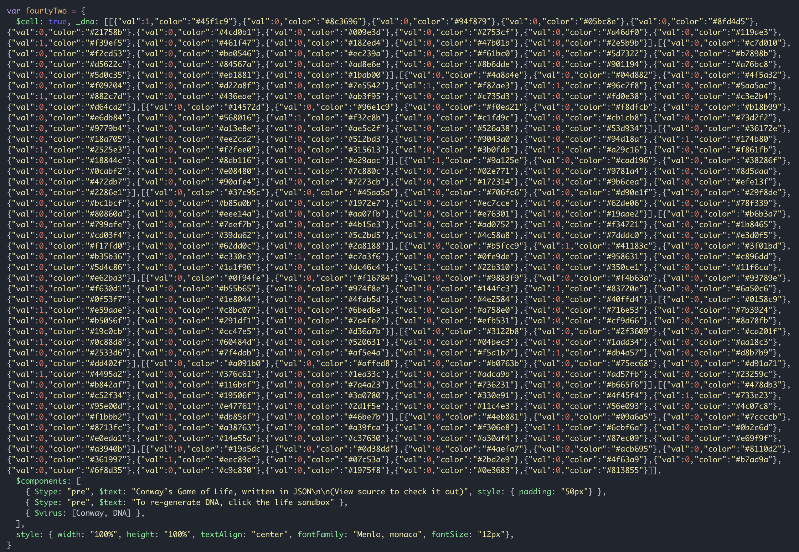
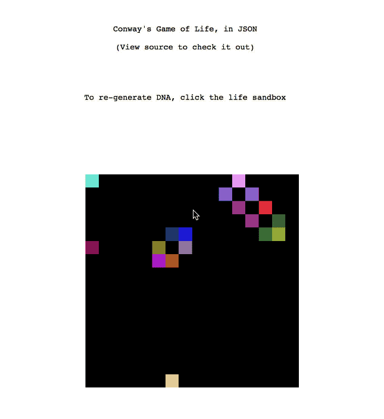

# Conway's Game of Life in JSON

This web app is an attempt at creating a [Conway's game of life](https://en.wikipedia.org/wiki/Conway%27s_Game_of_Life) from a JSON markup, powered by [cell.js](https://www.celljs.org), a JSON-based web app framework.

The entire app logic is expressed with [a single declarative JSON object](https://github.com/intercellular/conway/blob/master/index.html#L22):

When you run it, it looks like this:

# Demo

Try out the demo at [https://intercellular.github.io/conway/](https://intercellular.github.io/conway/)

# How it works

The app is powered by [cell.js](https://www.celljs.org), which enables the JSON based approach to building web apps.

To be able to write the entire app in near-100% JSON markup format, we use two [$virus](https://github.com/intercellular/cell/blob/develop/VIRUS.md):

1. [conway.virus.js](conway.virus.js): Generates the game of life sandbox DOM.
2. [dna.virus.js](dna.virus.js): Re-generates the "DNA" sequence from which the conway's game of life builds itself.

The whole point of `$virus` is that developers can abstract reusable logic into functions that take a JSON object as input and return another JSON as output, thereby "infecting" the original cell. And this is how `cell.js` implements plugins.
