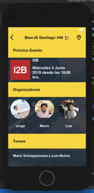

# BeerJS - Chile

This app is made using:
 
 - [https://jasonelle.com](https://jasonelle.com).
 - [https://github.com/akveo/eva-icons](https://github.com/akveo/eva-icons).

 Thanks to the folks at:

 - [https://devschile.cl](https://devschile.cl)
 - [https://beerjs.cl](https://beerjs.cl)

## splash.json

This file contains a simple splash screen that will be show
when the application is starting up. This is the init file
that should be configured as the starting json in the Xcode and Android Studio project.

The splash screen will show for 2 seconds and then load `index.json`.

Its recommended to use this splash as a preloader of further screens.

## index.json

This file contains the first screen to be shown in the app.

## events

Events are the json files that store each event data.

Each event will be stored in a folder named as `YYYYMM`. Example `201907`.
And a file named `event.json`.

### current.json

Stores the event that will be considered the current event.

## Demo

This example demostrates the usage of `vertical` and `horizontal`
scrolling. Using `mixins`, `global`, `images`, `text`, `maps`, `timers` and `calendars`.

Test it using the following url in `strings.xml` (Android) or `settings.plist` (iOS)

`https://raw.githubusercontent.com/jasonelle/docs/develop/examples/jasonette/apps/beerjs/splash.json`
