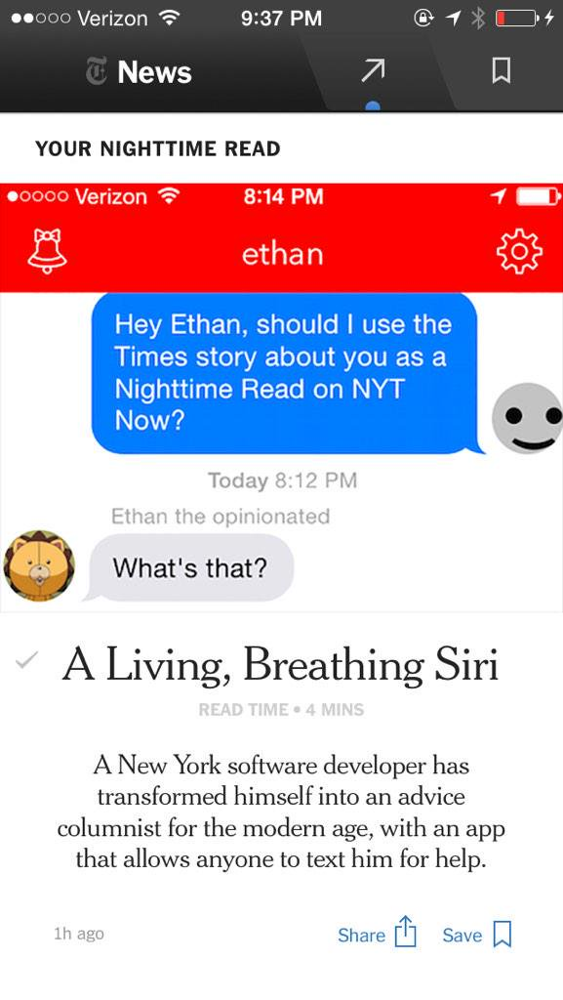

# History

*Jasonette* was created by *Ethan Gliechtenstein*, 30+ years old New York developer. Probably from Bushwick. Who's real identity nobody knows.

*Jasonette* core began in Late 2014 as an app named *Ethan*  (`http://www.textethan.com/`)

It got quickly popular.

| | |
|--|--|
|Tech Crunch| [https://techcrunch.com/2014/10/30/meet-samantha-ethan-apps-sister/](https://techcrunch.com/2014/10/30/meet-samantha-ethan-apps-sister/)
|Ny Times| [https://www.nytimes.com/2014/12/18/style/ethan-siri-meets-dr-phil.html](https://www.nytimes.com/2014/12/18/style/ethan-siri-meets-dr-phil.html)
|The Guardian| [https://www.theguardian.com/technology/2014/dec/04/-sp-ten-best-messaging-apps](https://www.theguardian.com/technology/2014/dec/04/-sp-ten-best-messaging-apps)
|CNN| [http://www.cnn.com/2014/10/11/tech/askethan-app](http://www.cnn.com/2014/10/11/tech/askethan-app)
|Spiegel| [http://www.spiegel.de/netzwelt/apps/ask-ethan-app-beantwortet-fragen-der-nutzer-a-997335.html](http://www.spiegel.de/netzwelt/apps/ask-ethan-app-beantwortet-fragen-der-nutzer-a-997335.html)
|Dazed Digital| [http://www.dazeddigital.com/artsandculture/article/22152/1/this-irl-siri-app-wants-to-answer-all-your-burning-questions](http://www.dazeddigital.com/artsandculture/article/22152/1/this-irl-siri-app-wants-to-answer-all-your-burning-questions)
|Business Insider| [http://www.businessinsider.com/ethan-is-the-top-app-on-product-hunt-2014-10](http://www.businessinsider.com/ethan-is-the-top-app-on-product-hunt-2014-10)
|SFGate | [http://www.sfgate.com/business/article/Stupid-apps-but-not-always-a-stupid-idea-5843629.php](http://www.sfgate.com/business/article/Stupid-apps-but-not-always-a-stupid-idea-5843629.php)

| | |
|--|--|
| 

If you want to see the prototype *Jasonette JSON syntax*, see the archived repo here:
[https://github.com/jasonelle/docs/tree/develop/examples/jasonette/apps/archived-ethan-app](https://github.com/jasonelle/docs/tree/develop/examples/jasonette/apps/archived-ethan-app)

Some time after that Ethan began extracting the core, refining the api and creating documentation. 
First released *Jason* App on May 17th 2016 and 
finally releasing the first version of *Jasonette* on November 3th 2016.

> Ethan:
> I found that it takes too much effort going 
> from having an idea to building an app and having the world use it. 
> I wanted a way to have an idea, turn it into a fully functional native app, 
> and share it with the world, all in the next 10 minutes, almost like writing a blog post.
> That's why I built Jason. Jason is a completely hackable iOS client that does what 
> you tell it to do. You just write a script in JSON and load it from Jason. 
> Jason then interprets it in realtime and turns it into a native app. 

- [https://www.producthunt.com/gliechtenstein](https://www.producthunt.com/@gliechtenstein)
- [https://www.producthunt.com/posts/jason](https://www.producthunt.com/posts/jason)
- [https://www.producthunt.com/posts/jasonette](https://www.producthunt.com/posts/jasonette)

- [https://twitter.com/jasonclient/status/794175517763272708](https://twitter.com/jasonclient/status/794175517763272708)

Ethan worked on *Jasonette*, *Cell* and *ST* for nearly 2 years straight full-time. 
Until June 9 2018 were he misteriosly disappeared without a trace. 
Later on November 6th 2018. *Jasonelle Team* took the lead 
([https://github.com/Jasonette/Jasonette/issues/23](https://github.com/Jasonette/Jasonette/issues/23)).

The original repositories of *Jasonette, Cell and ST* are:

- [https://github.com/jasonette](https://github.com/jasonette)
- [https://github.com/intercellular](https://github.com/intercellular)
- [https://github.com/selecttransform](https://github.com/selecttransform)

PD: If you want to know that character 
Ethan uses it's Kon from Bleach 💯 ([http://bleach.wikia.com/wiki/Kon](http://bleach.wikia.com/wiki/Kon))
