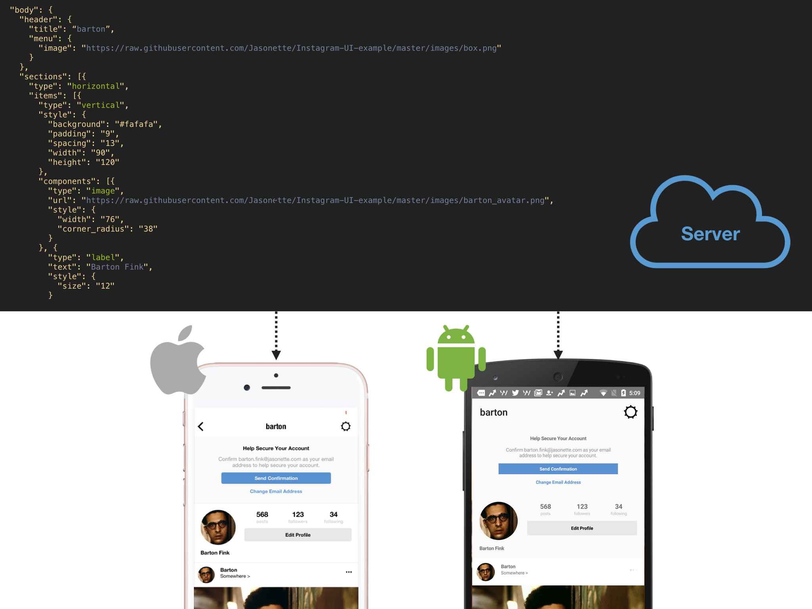
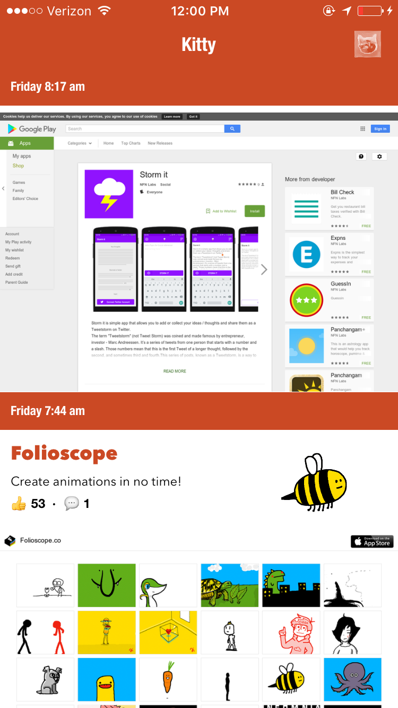

## Introduction

*Jasonette* abstracts away all low level programming with a JSON based markup.
All you need to write is a single JSON.

### JSON to Native Components

Just like how web browsers turn HTML into a web page,
**Jasonette turns JSON into iOS and Android native components.**
This lets you build native apps by writing a simple JSON.



#### Structure

Organize your code in nested JSON objects.

**Example:**

```json
{
    "$jason": {
        "head": {...},
        "body": {
            "sections": [{
            "items": [
                { "type": "image", "url": "..." },
                { "type": "label", "text": "..." },
                ...
            ]
            }]
        }
    }
}
```

#### Layout

Construct complex layouts with JSON.

**Example:**

Build a card UI with an image, labels, and nested layouts.


```json
{
    "type": "horizontal",
    "components": [
        { "type": "image", "url": "file://ethan.jpeg" },
        { "type": "vertical",
        "components": [
            { "type": "label", "text": "Ethan" },
            { "type": "label", "text" "www.textethan.com" }
        ]
        }
    ]
}
```

#### Actions

Describe actions with JSON.

**Example:** 

Make a network request and draw the result.

```json
{
    "type": "$network.request",
    "options": {
        "url": "http://api.giphy.com/v1/gifs/search",
        "data": { "q": "kitten", "api_key": "dc6zaTOxFJmzC" }
    },
    "success": {
        "type": "$render"
    }
}
```

#### Style

Style components with JSON.

**Example:**

Style a label.

```json
{
    "type": "label",
    "text": "Hello World",
    "style": {
        "padding": "10",
        "corner_radius": "5",
        "background": "rgba(0,0,0,0.4)",
        "color": "#ffffff",
        "font": "HelveticaNeue"
    }
}
```

#### Native App Over JSON

Directly manipulate native APIs simply using JSON.
For Android, this means direct access to LinearLayout, RecyclerView, etc.
For iOS, this means direct access to UITableView, UIStackView, etc.

Want to make changes to your LIVE app?
Simply change your JSON content on the server,
and watch the app change in front of your eyes, instantly!.


#### Native Components

These are some Native Components you can access using just JSON.

| | |
|--|--|
|  |  
|  | 

And much more! Including:

- 1. Direct access to the device such as camera, audio, geolocation, video, network request, etc.
- 2. Powerful layout engine that directly manipulates native components such as UITableView, UIStackView, UIView, etc.
- 3. Describe styling and event handling all with JSON


#### Cross Platform

100% native binary for both *Android* and *iOS*.

| iOS | Android |
|--|--|
|  | 

### Free & Battle Tested

*Jasonette* was extracted from several production apps on the 
App Store, so you know it works.

Below are some actual production apps built with *Jasonette*.

| Kitty | Catch All |
|--|--|
|  | 

#### 100% FREE
Everything is free for you to use. 
There is no small print that says "pay $$$ if you want to publish your app". 
It's all yours.

#### 100% OPEN SOURCE
Jasonette is licensed under MIT license. 
Take the code, build and publish your own apps, and do whatever you want with it!


#### 100% PORTABLE
There is no magical backend server you need to 
learn to use, pay for, or install to use Jasonette.
ALL YOU NEED IS JSON. 
If you have a web server, you ALREADY have a Jasonette server.

#### 100% EXTENSIBLE
Jasonette is essentially just an engine that maps JSON expression to 
native components and actions. 
It doesn't force you to drop everything and adopt the technology exclusively. 
You can extend it or even integrate it with your existing native code seamlessly.
