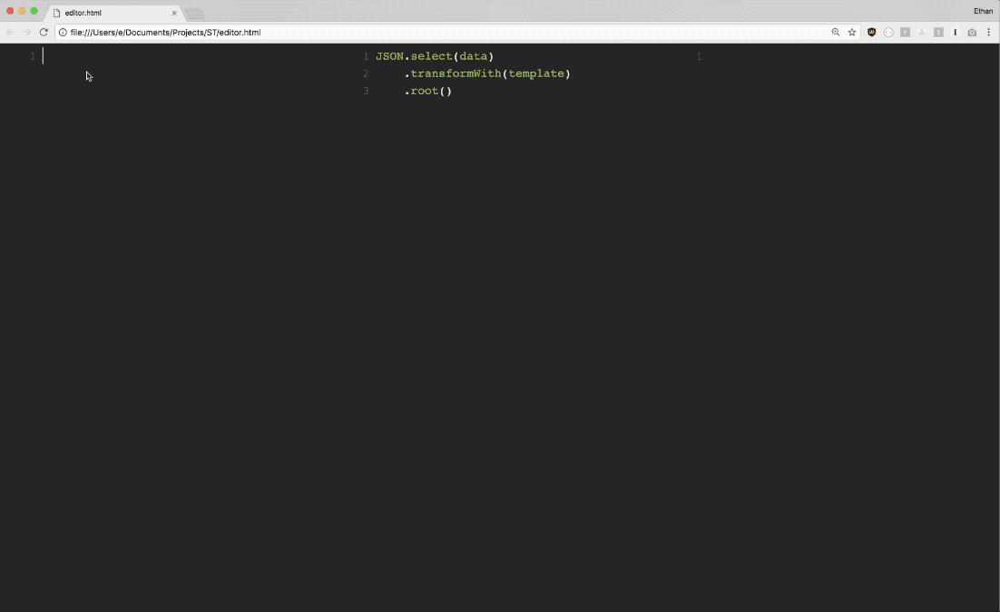

# Ja.js - Selector Transformer

*Ja.js* (previously named *st.js*) is a library 
that enables implementing
practically any programming concept in a declarative manner, 
using *JSON*.

This is because `ja.js` is a low level building block for creating a 
**Turing Complete JSON markup language**.

`ja.js` is the core *JSON parser* that powers **Jasonette**, 
so you can build native *iOS/Android* apps by 
writing nothing but a *JSON markup*.

But *Jasonette* is just one implementation.
Want to build your own turing complete JSON markup language?

## Repository

[https://github.com/jasonelle/ja.js](https://github.com/jasonelle/ja.js)

## Playground

Parse *JSON* anywhere,
both frontend and backend, as easy as using 
`JSON.stringify` or `JSON.parse`.

[https://jasonelle.com/docs/playground-ja/](https://jasonelle.com/docs/playground-ja/)

**Source Code**:

[https://github.com/jasonelle/docs/tree/develop/playground-ja](https://github.com/jasonelle/docs/tree/develop/playground-ja).
