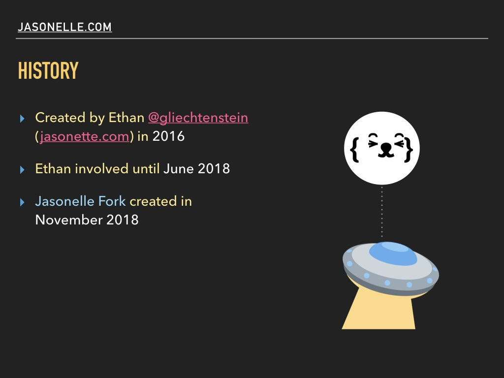
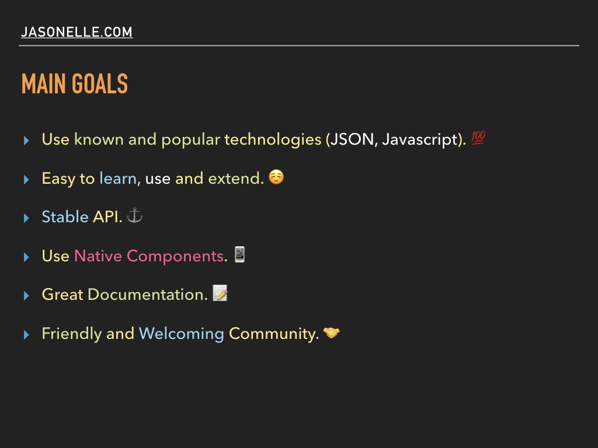
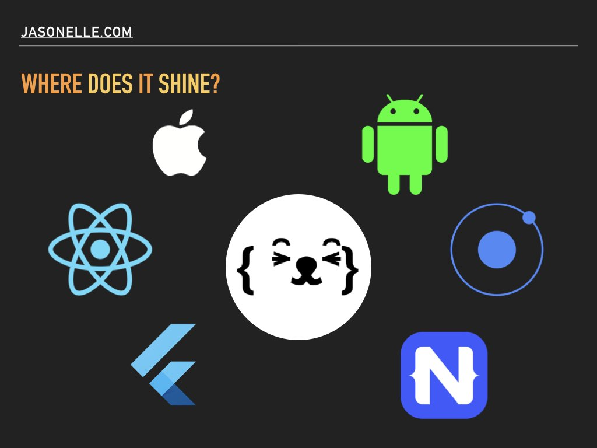
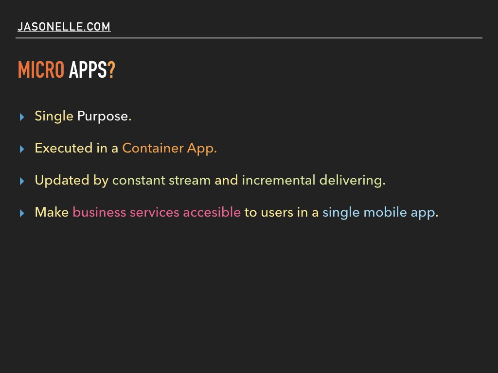
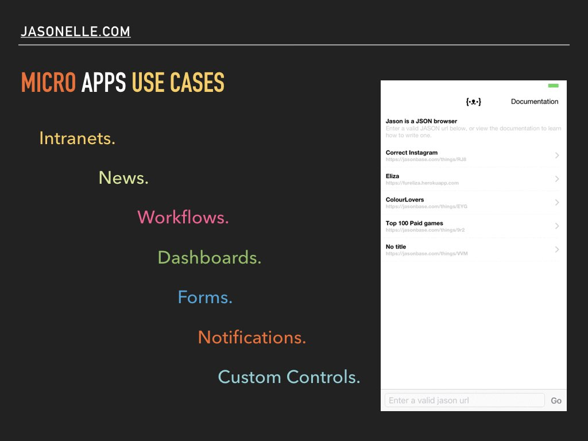

## BeerJS - Chile - 2019

June 5th 2019, was made a presentation of *Jasonelle*
in Santiago, Chile.

The presentation slides and related code is stored 
in the following repository:

[https://github.com/jasonelle/beerjs](https://github.com/jasonelle/beerjs)

