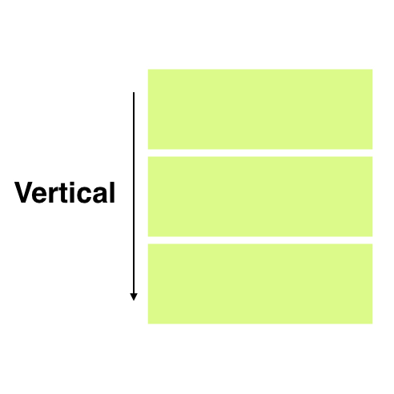
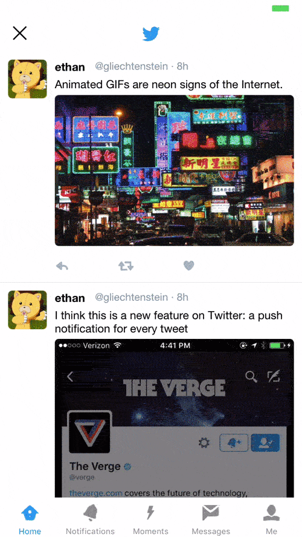
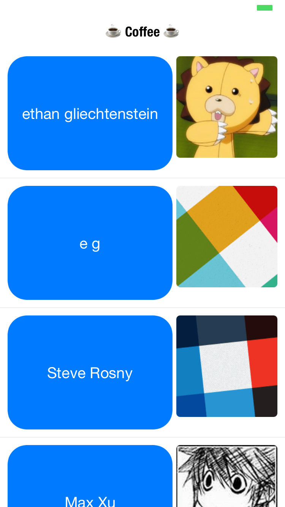
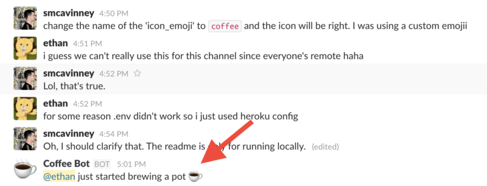
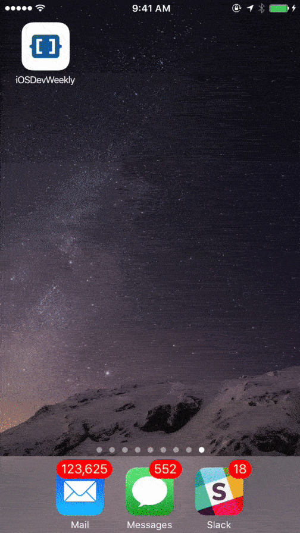

## Building cross-platform mobile apps using nothing more than a JSON markup


> This article was written by Ethan on FreeCodeCamp.
> [https://www.freecodecamp.org/news/how-to-build-cross-platform-mobile-apps-using-nothing-more-than-a-json-markup-f493abec1873/#.i83lzc4g9](https://www.freecodecamp.org/news/how-to-build-cross-platform-mobile-apps-using-nothing-more-than-a-json-markup-f493abec1873/#.i83lzc4g9)

For the past few months, I’ve been working on a new way to build cross-platform, 
native iOS and Android apps called *Jasonette*.


It lets you describe an entire app with nothing but a single JSON markup.

If your app consists entirely of JSON, it can be treated like any other data. 
And it can be served remotely from the cloud on-demand.


The app logic no longer needs to be hardcoded on the device, 
and you can update it as much as you want just by updating your JSON on the server-side. 
Your app will be freshly loaded from the server every time you open it.

*Jasonette* has many different parts. 
You can express functions, templates, styles, and more all by using a JSON Markup. 
And as a result, you can write a super-sophisticated native mobile app in a fully 
Model — View — Controller ([https://en.wikipedia.org/wiki/Model-view-controller](https://en.wikipedia.org/wiki/Model%E2%80%93view%E2%80%93controller)) 
manner.

In this post I’ll show you specifically the “View” part:

- How *Jasonette* expresses various cross-platform UI patterns in JSON.
- How it implements these JSON-to-Native mappings internally.

### Basic Structure

Under the hood, *Jasonette* works similarly to a web browser. 
But instead of interpreting an HTML markup and drawing a web view, *Jasonette* fetches a 
JSON markup and constructs a native view, on-the-fly.

The markup is just a JSON file that follows some predefined conventions.
First of all, it starts with a `$jason` key, which has two children: 
`head` and `body`, and looks like this:

```
{
  "$jason": {
    "head": {
      // ..metadata about the document...
    },
    "body": {
      // ..actual content to be displayed on the view..
    }
  }
}

```

### Design Philosophy

When I first started designing the JSON syntax for describing native views, 
I had a couple of constraints in mind:

- **Native**: There’s a reason why iOS and Android came up with their own native layout systems. 
The layout systems designed for the desktop era don’t always translate well to the small device world. 
The syntax should express the underlying layout in as mobile native manner as possible.

- **Cross platform**: Yet it needs to be cross platform. For example, 
iOS has something called autolayout ([https://developer.apple.com/library/content/documentation/UserExperience/Conceptual/AutolayoutPG](https://developer.apple.com/library/content/documentation/UserExperience/Conceptual/AutolayoutPG)) 
and visual format language ([https://developer.apple.com/library/content/documentation/UserExperience/Conceptual/AutolayoutPG/VisualFormatLanguage.html](https://developer.apple.com/library/content/documentation/UserExperience/Conceptual/AutolayoutPG/VisualFormatLanguage.html))
but these are not implemented natively on Android, so not the right solution.

- **Simple yet expressive**: It should be easily expressed in a simple JSON format and easy 
to compose into a sophisticated structure.


When you take a look at how most mobile apps are built, 
they all boil down to a small number of common interface patterns:

- Vertically scrolling list
- Horizontally scrolling list
- Absolute positioning
- Grid

Let’s take a look at the first three, since they are most widely used.

### Sections — Describing scrolling lists

The most frequently used UI pattern is scrolling lists. On *Jasonette* we call them sections.

There are two types of sections: `Vertical` and `Horizontal`. 
Vertical sections scroll vertically, and horizontal sections horizontally.

|||
|--|--|
||
|Vertical Section| Horizontal Section|


#### Implementation — Vertical Sections

This is probably the most frequently used UI for displaying data on mobile devices. 
On iOS, *Jasonette* implements this with UITableView ([https://developer.apple.com/reference/uikit/uitableview](https://developer.apple.com/reference/uikit/uitableview)). 
On Android it’s implemented with RecyclerView ([https://developer.android.com/reference/android/support/v7/widget/RecyclerView.html](https://developer.android.com/reference/android/support/v7/widget/RecyclerView.html)).

```json
{
  "body": {
    "sections": [{
      "items": [{
        "type": "label",
        "text": "Item 1"
      }, {
        "type": "label",
        "text": "Item 2"
      }, {
        "type": "label",
        "text": "Item 3"
      }]
    }]
  }
}
```

On iOS, above JSON markup creates a `UITableView` ([https://developer.apple.com/reference/uikit/uitableviewcell](https://developer.apple.com/reference/uikit/uitableviewcell)) 
with three `UITableViewCells` ([https://developer.apple.com/reference/uikit/uitableviewcell](https://developer.apple.com/reference/uikit/uitableviewcell)), 
each of which contains a `UILabel` ([https://developer.apple.com/reference/uikit/uilabel](https://developer.apple.com/reference/uikit/uilabel)), with corresponding text attributes.


On Android, it creates a `RecyclerView` with three items, 
each of which is a `TextView` ([https://developer.android.com/reference/android/widget/TextView.html](https://developer.android.com/reference/android/widget/TextView.html))
that displays the corresponding `text` attributes.


All of these are constructed programmatically without any use of Storyboards in iOS ([https://developer.apple.com/library/content/documentation/General/Conceptual/Devpedia-CocoaApp/Storyboard.html](https://developer.apple.com/library/content/documentation/General/Conceptual/Devpedia-CocoaApp/Storyboard.html)) 
or  XML layout files (Android) ([https://developer.android.com/guide/topics/resources/layout-resource.html](https://developer.android.com/guide/topics/resources/layout-resource.html)) 
in order to make sure every detail is programmable dynamically.

#### Implementation — Horizontal Sections

Syntax-wise, horizontal sections are not much different, 
all you need to do is set the `type` as “`horizontal`”, and the items flow horizontally.

```json
{
  "body": {
    "sections": [{
      "type": "horizontal",
      "items": [{
        "type": "label",
        "text": "Item 1"
      }, {
        "type": "label",
        "text": "Item 2"
      }, {
        "type": "label",
        "text": "Item 3"
      }]
    }]
  }
}
```

> Note

The syntax for the horizontal section is simple, 
but internally it’s actually quite complex. 
Horizontal sections on iOS were implemented with UICollectionView ([https://developer.apple.com/reference/uikit/uicollectionview](https://developer.apple.com/reference/uikit/uicollectionview)). 
It’s a well-known technique, but basically a horizontally scrolling UICollectionView is 
embedded into its parent UITableView (which scrolls vertically). 
And on Android, it’s implemented in a similar manner, but using nested RecyclerViews instead.

### Items — Describing layout within each scrolling unit

Now that we understand how the top level view is structured, 
let’s look at `items`. Each section is made up of multiple units of scrollable `items`. 
Note that each item has a fixed dimension and nothing inside the item itself scrolls.

An item can be:

- Just a single component like a `label`, `image`, `button`, `textarea`, etc.
- A combination of all of those components.


Implementing this part was not as straight-forward as the `sections` implementation, 
because I had to choose a **cross-platform, native, simple, and expressive way** to form a 
super-sophisticated layout.


Thankfully, iOS and Android have very similar native layout systems called 
UIStackView ([https://developer.apple.com/reference/uikit/uistackview](https://developer.apple.com/reference/uikit/uistackview)) 
and LinearLayout ([https://developer.android.com/reference/android/widget/LinearLayout.html](https://developer.android.com/reference/android/widget/LinearLayout.html)), 
respectively. 
And these layout schemes in turn are similar to CSS Flexbox ([https://developer.mozilla.org/en-US/docs/Web/CSS/CSS_Flexible_Box_Layout/Using_CSS_flexible_boxes](https://developer.mozilla.org/en-US/docs/Web/CSS/CSS_Flexible_Box_Layout/Using_CSS_flexible_boxes)), 
so I would say it’s as cross-platform as it can get.


Lastly, these layout systems are infinitely composable. 
As seen below, you can create a vertical layout, a horizontal layout, 
or nest a vertical layout within a horizontal layout, and so forth, recursively.




To create a vertical layout, you would set the type as `vertical`, and then set its `components`:

```json
{
  "items": [{
    "type": "vertical",
    "components": [{
      "type": "label",
      "text": "First"
    }, {
      "type": "label",
      "text": "Second"
    }, {
      "type": "label",
      "text": "Third"
    }]
  }]
}
```


Same thing with horizontal layout. Just set the type as `horizontal` instead:

```json
{
  "items": [{
    "type": "horizontal",
    "components": [{
      "type": "image",
      "url": "http://i.giphy.com/LXONhtCmN32YU.gif"
    }, {
      "type": "label",
      "text": "Rick"
    }]
  }]
}
```

Nesting layouts is as simple as specifying a layout as another layout’s component.

```json
{
  "items": [{
    "type": "horizontal",
    "components": [{
      "type": "image",
      "url": "http://i.giphy.com/LXONhtCmN32YU.gif"
    }, {
      "type": "vertical",
      "components": [{
        "type": "label",
        "text": "User"
      }, {
        "type": "label",
        "text": "Rick"
      }]
    }]
  }]
}
```

I have not talked about the styling feature here for the sake of brevity, 
but you can style each individual component as well as the layout itself to make sure the 
layout looks exactly like you wanted. 
All you need to do is add `style` objects 
describing `font`, `size`, `width`, `height`, `color`, `background`, `corner_radius`, `opacity`, etc.


### Layers — AKA “absolute positioning”

Sometimes you may want to position items at exactly certain parts of the 
screen without scrolling. In CSS-terms we would call this *“absolute positioning”*. 
*Jasonette* supports this through what’s called `layers`.


Currently layer supports two types of child components: `image` and `label`. 
You can place these components anywhere you desire on the screen this way. Here’s an example:


In this example, we have two labels (the temperature and the weather messages) 
and an image (the camera icon) on the screen, whose coordinates have been explicitly 
set to make sure they stay in place without scrolling. 

The markup would look something like this:

```json
{
  "$jason": {
    "body": {
      "style": {
        "background": "camera"
      },
      "layers": [{
        "type": "label",
        "text": "22°C",
        "style": {
          "font": "HelveticaNeue-Light",
          "size": "20",
          "top": "50",
          "left": "50%-100",
          "width": "200",
          "align": "center"
        }
      }, {
        "type": "label",
        "text": "few clouds",
        "style": {
          "font": "HelveticaNeue",
          "size": "15"
        }
      }, {
        "type": "image",
        "url": "https://s3.amazonaws.com/.../camera%402x.png",
        "style": {
          "bottom": "100",
          "width": "30",
          "color": "#ffffff",
          "right": "30"
        }
      }]
    }
  }
}
```

Amazingly enough, this is all you need to know in order to build any 
kind of sophisticated view you can imagine on mobile devices.


Just like you can build anything with simple lego blocks,
you can compose these basic components and layouts in different ways 
to create any sophisticated view.

Here are some examples, 100% built by composing aforementioned UI elements:

- Instagram UI ([https://github.com/jasonelle/docs/tree/master/examples/jasonette/apps/instagram](https://github.com/jasonelle/docs/tree/master/examples/jasonette/apps/instagram))
- Twitter UI ([https://github.com/jasonelle/docs/tree/master/examples/jasonette/apps/twitter](https://github.com/jasonelle/docs/tree/master/examples/jasonette/apps/twitter))




### Beyond Views

If you read this far, you may be either thinking:

- “Wow cool! I wanna try this!”, or
- “Yeah you can probably build a toy app, but no way you can build a production app using this way!”.


Like I briefly mentioned above, this is just the *“View”* part of *Jasonette*, 
which is the simplest part. But what’s really powerful about
*Jasonette* is that you can actually go much further and write a full declarative program in JSON.


You can attach actions to UI elements, which get triggered when a user touches them. 
You can also trigger these actions one after another via success/error callbacks. 
You can also listen to certain events and automatically trigger these actions.


Just like this, when you can describe not just a 
*“View”* but also the *“Model”* and the *“Controller”* 
logic (all in JSON), **you can do anything**.

### What is possible?

Since all you need is a server that sends JSON,
*Jasonette* is completely platform agnostic. 
There is no proprietary server technology you need to depend on. All you need is JSON.

And JSON can come from anywhere, from local device, to remote servers, to even a Raspberry pi!
([https://www.raspberrypi.org/documentation/remote-access/web-server/nginx.md](https://www.raspberrypi.org/documentation/remote-access/web-server/nginx.md)).

- **Have a web app?** : If you already have a web app, 
you can instantly build a mobile native app for your *Node.js app, 
Rails app, Django app, PHP app, or really any web app*, just by making requests to your API endpoint.

- **You don’t even need a server** : Since you can fit an entire model-view-controller 
in a single, self-contained JSON file, you can pretty much store and serve it from anywhere. 
You can even create an app from a static JSON file served from a Pastebin or Github!.

- **Turn any HTML website into an app** : *Jasonette* has a powerful HTML-to-JSON 
parser powered by the cheerio library which lets you transform any HTML into a JSON object. 
And you already know what we can do when we have JSON — you can build a native 
view from the transformed JSON! This way, you can build a native app from a 
website that doesn’t even have an API. Of course, the recommended way is to use 
JSON whenever you can, but this is really cool regardless.


I can go on forever, but here are some examples:

A photo sharing app that lets you take a photo using the device 
camera and upload it to S3, and then post the entry to your own server, creating a feed:

[https://github.com/jasonelle/docs/tree/develop/examples/jasonette/apps/s3-upload-example](https://github.com/jasonelle/docs/tree/develop/examples/jasonette/apps/s3-upload-example)


A Node.js powered Eliza Chatbot app for iOS and Android:

[https://github.com/jasonelle/docs/tree/develop/examples/jasonette/apps/eliza-example](https://github.com/jasonelle/docs/tree/develop/examples/jasonette/apps/eliza-example)


A Microblog app, complete with session management:

[https://github.com/jasonelle/docs/tree/develop/examples/jasonette/apps/token-authentication-example](https://github.com/jasonelle/docs/tree/develop/examples/jasonette/apps/token-authentication-example)


|||
|--|--|
|||


A remote control app for Slack bots:

[http://jasonelle.com/jasonette-old-blog/2017/01/17/build-a-slackbot-with-jasonette/](http://jasonelle.com/jasonette-old-blog/2017/01/17/build-a-slackbot-with-jasonette/)

[https://github.com/jasonelle/docs/tree/develop/examples/jasonette/apps/coffee-app](https://github.com/jasonelle/docs/tree/develop/examples/jasonette/apps/coffee-app)


|||
|--|--|
|||


An example app that turns an HTML web page into JSON and then turns it into a native app:

[https://github.com/jasonelle/docs/tree/develop/examples/jasonette/apps/iosdevweekly](https://github.com/jasonelle/docs/tree/develop/examples/jasonette/apps/iosdevweekly)




### Conclusion

*Jasonette* is a young project. I open-sourced the iOS version in late 2016, 
and the Android version a month later.

But it has already grown into a vibrant community of contributors and makers and is
under active development. I hope this technology will 
empower anyone (not just developers) to build apps effortlessly.
