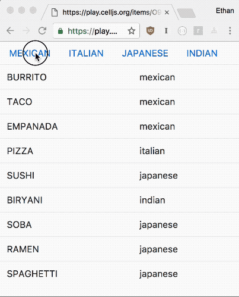

# Collection Filtering

Storing a root collection on the element, and then keeping another collection based on the chosen filter. 

Whenever you update the collection content, the view synchronizes through $update() function.

